# DPM-Solver on MNIST

This repository implements **DPM-Solver-2** and **DPM-Solver-3** samplers from scratch based on the [`minDiffusion`](https://github.com/cloneofsimo/minDiffusion) starter code.

The implementation is tested on the **MNIST** dataset and compared with **DDIM**, which is equivalent to **DPM-Solver-1** according to the DPM-Solver paper.

Paper: [DPM-Solver: A Fast ODE Solver for Diffusion Probabilistic Model Sampling in Around 10 Steps](https://arxiv.org/abs/2206.00927)

---

## 1. Goal

The homework requires implementing DPM-Solver samplers and testing them on MNIST.

In this project, I implemented and compared:

- **DDIM**, used as the baseline and equivalent to **DPM-Solver-1**
- **DPM-Solver-2**
- **DPM-Solver-3**

All three samplers use the same trained MNIST diffusion model. Only the sampling algorithm is changed during comparison.

---

## 2. Repository Structure

```text
.
├── data/
│   └── MNIST/
│       └── raw/                  # MNIST raw files
├── mindiffusion/
│   ├── ddpm.py
│   ├── unet.py
│   └── dpm_solver_sampler.py     # DPM-Solver implementation
├── contents/
│   └── hw4/
│       ├── ddpm_train_epoch_xxx.png
│       ├── ddim_nfe_xx.png
│       ├── dpm_solver_2_nfe_xx.png
│       └── dpm_solver_3_nfe_xx.png
├── train_mnist_hw4.py
├── compare_mnist_samplers.py
├── requirements.txt
└── README.md
```

The trained `.pth` checkpoint is not included in this repository. Please train the model first before running the sampler comparison.

---

## 3. Method

DPM-Solver is a fast ODE solver for diffusion model sampling. It uses the probability flow ODE of diffusion models and exploits the semi-linear structure of the diffusion ODE.

For VP-type diffusion models, the solver uses the half-log-SNR variable:

```text
lambda_t = log(alpha_t / sigma_t)
```

where

```text
alpha_t = sqrt(alpha_bar_t)
sigma_t = sqrt(1 - alpha_bar_t)
```

Thus,

```text
lambda_t = log(alpha_t) - log(sigma_t)
```

In the implementation, the DDPM noise schedule is reused to compute `alpha_t`, `sigma_t`, and `lambda_t`.

---

## 4. DDIM as DPM-Solver-1

DDIM is used as the baseline sampler.

According to the DPM-Solver paper, DDIM has the same update form as the first-order DPM-Solver. Therefore, in this project:

```text
DDIM = DPM-Solver-1
```

This makes the comparison fair because DDIM, DPM-Solver-2, and DPM-Solver-3 use the same trained neural network and the same noise schedule.

---

## 5. DPM-Solver-2

DPM-Solver-2 uses one intermediate midpoint evaluation in each solver step.

For one step from time `s` to time `t`, it first computes a midpoint `m` and an intermediate state `u`:

```text
u = alpha_m / alpha_s * x_s - sigma_m * (exp(h / 2) - 1) * eps_theta(x_s, s)
```

Then it uses the model prediction at the midpoint to update the sample:

```text
x_t = alpha_t / alpha_s * x_s - sigma_t * (exp(h) - 1) * eps_theta(u, m)
```

This gives a second-order approximation of the diffusion ODE solution.

---

## 6. DPM-Solver-3

DPM-Solver-3 uses two intermediate model evaluations with:

```text
r1 = 1 / 3
r2 = 2 / 3
```

It estimates higher-order changes of the noise prediction model and performs a third-order update.

Each full DPM-Solver-3 step uses three model evaluations. When the total NFE is not divisible by 3, the remaining budget is filled by a first-order or second-order step.

---

## 7. How to Run

### 7.1 Install Dependencies

```bash
pip install -r requirements.txt
```

### 7.2 Prepare MNIST

The MNIST raw files should be placed under:

```text
data/MNIST/raw/
```

For example:

```text
data/MNIST/raw/train-images-idx3-ubyte
data/MNIST/raw/train-labels-idx1-ubyte
data/MNIST/raw/t10k-images-idx3-ubyte
data/MNIST/raw/t10k-labels-idx1-ubyte
```

### 7.3 Train the MNIST Diffusion Model

```bash
python train_mnist_hw4.py
```

This trains a DDPM-style diffusion model on MNIST.

Training samples are saved to:

```text
contents/hw4/
```

### 7.4 Compare Samplers

```bash
python compare_mnist_samplers.py
```

The script compares:

- DDIM
- DPM-Solver-2
- DPM-Solver-3

under different NFE values:

```text
NFE = 5, 10, 15, 20, 30, 50
```

The generated samples are saved to:

```text
contents/hw4/
```

---

## 8. Training Samples

The following images show generated samples during DDPM training.

| Epoch 0 | Epoch 5 | Epoch 10 |
|---|---|---|
|  |  |  |

| Epoch 15 | Epoch 20 | Epoch 25 |
|---|---|---|
|  |  |  |

| Epoch 29 |
|---|
|  |

---

## 9. Qualitative Comparison

The following tables compare DDIM, DPM-Solver-2, and DPM-Solver-3 under different NFE values.

NFE means **Number of Function Evaluations**, namely the number of neural network calls during sampling.

---

### NFE = 5

| DDIM | DPM-Solver-2 | DPM-Solver-3 |
|---|---|---|
| 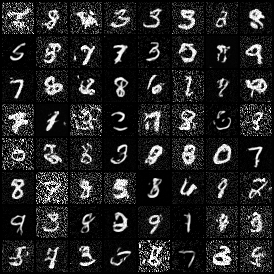 | 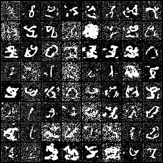 | 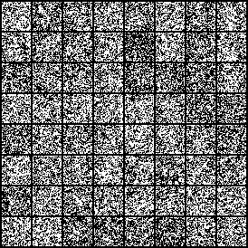 |

At extremely low NFE, the step size is very large. The generated samples are noisy, especially for DPM-Solver-3. This is likely caused by numerical instability when using a high-order solver with too few steps.

---

### NFE = 10

| DDIM | DPM-Solver-2 | DPM-Solver-3 |
|---|---|---|
| 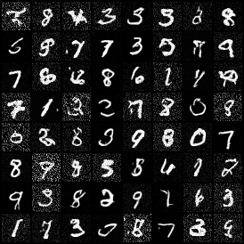 | 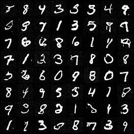 | 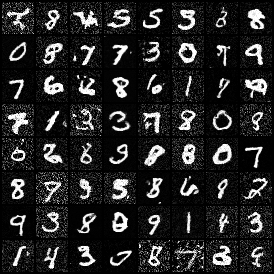 |

At NFE = 10, the samples become more recognizable. DPM-Solver-2 usually gives cleaner digit shapes than the extremely low-NFE setting.

---

### NFE = 15

| DDIM | DPM-Solver-2 | DPM-Solver-3 |
|---|---|---|
| 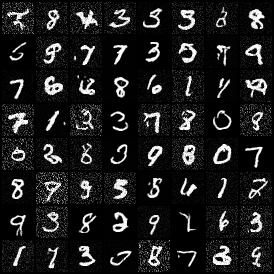 | 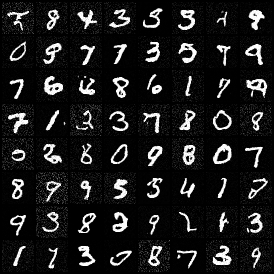 | 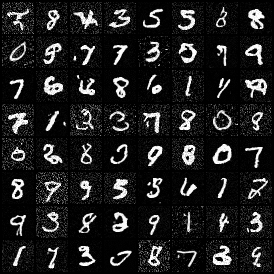 |

At NFE = 15, the generated digits are more stable. Higher-order solvers benefit from using more function evaluations.

---

### NFE = 20

| DDIM | DPM-Solver-2 | DPM-Solver-3 |
|---|---|---|
| 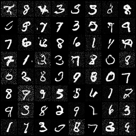 | 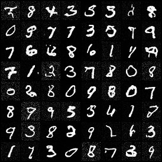 | 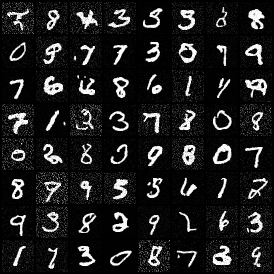 |

At NFE = 20, all methods can generate clear MNIST-like samples.

---

### NFE = 30

| DDIM | DPM-Solver-2 | DPM-Solver-3 |
|---|---|---|
| 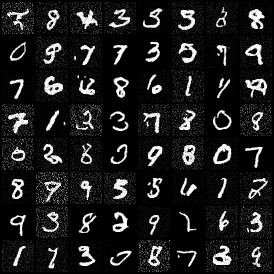 | 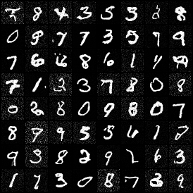 |  |

At NFE = 30, the visual quality improves further, and the difference between different samplers becomes smaller.

---

### NFE = 50

| DDIM | DPM-Solver-2 | DPM-Solver-3 |
|---|---|---|
| 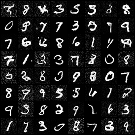 | 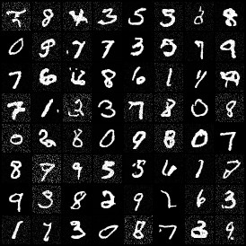 | 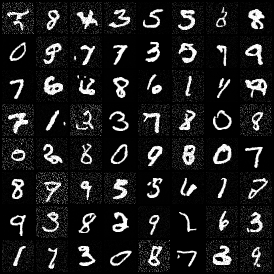 |

At NFE = 50, all samplers generate good samples. The qualitative difference is less obvious than in the low-NFE regime.

---

## 10. Discussion

From the qualitative results, we can observe:

1. All samplers generate better samples as NFE increases.
2. DDIM works as a reasonable first-order baseline.
3. DPM-Solver-2 is relatively stable in low-NFE and medium-NFE settings.
4. DPM-Solver-3 can be unstable when NFE is extremely small, such as NFE = 5, because each solver step becomes too large.
5. When NFE is large enough, the visual difference between DDIM, DPM-Solver-2, and DPM-Solver-3 becomes smaller.

This project focuses on qualitative comparison, following the homework discussion. No FID or classifier-based quantitative metric is required.

---

## 11. NFE Counting

For fair comparison, the total number of neural network evaluations is controlled.

- DDIM uses one model evaluation per step.
- DPM-Solver-2 uses two model evaluations per full second-order step.
- DPM-Solver-3 uses three model evaluations per full third-order step.

When the NFE budget is not divisible by the solver order, the remaining function evaluations are used by lower-order steps.

For example:

```text
NFE = 10 for DPM-Solver-3
= 3 + 3 + 3 + 1
```

This ensures that all methods are compared under the same NFE budget.

---

## 12. Conclusion

In this homework, I implemented DPM-Solver-2 and DPM-Solver-3 samplers from scratch and compared them with DDIM on MNIST.

The results show that DPM-Solver can generate recognizable MNIST samples under small NFE values. DPM-Solver-2 is especially stable in this experiment. DPM-Solver-3 may become unstable when NFE is too small, but its results improve as the NFE budget increases.

Overall, the implementation satisfies the homework requirement of implementing DPM-Solver samplers and qualitatively comparing them with DDIM under different NFE settings.

---

## References

- Cheng Lu, Yuhao Zhou, Fan Bao, Jianfei Chen, Chongxuan Li, Jun Zhu.  
  **DPM-Solver: A Fast ODE Solver for Diffusion Probabilistic Model Sampling in Around 10 Steps.**  
  NeurIPS 2022.  
  https://arxiv.org/abs/2206.00927

- minDiffusion starter code:  
  https://github.com/cloneofsimo/minDiffusion

- DDPM paper:  
  https://arxiv.org/abs/2006.11239

- DDIM paper:  
  https://arxiv.org/abs/2010.02502

